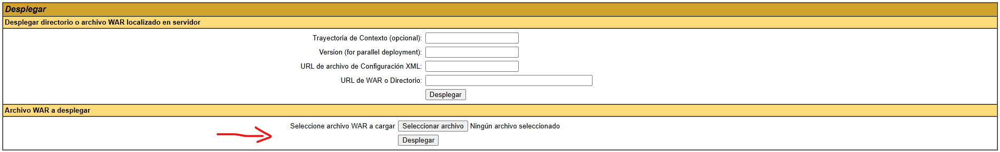
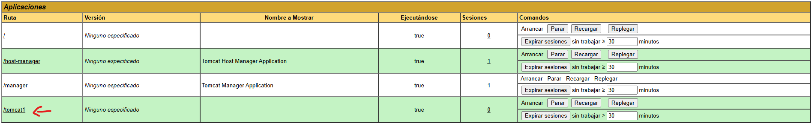
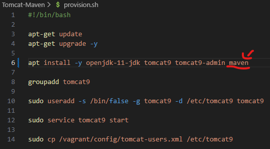
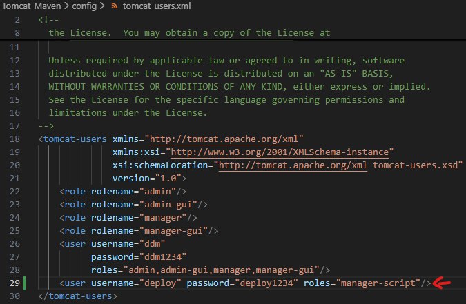
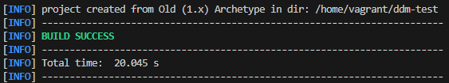
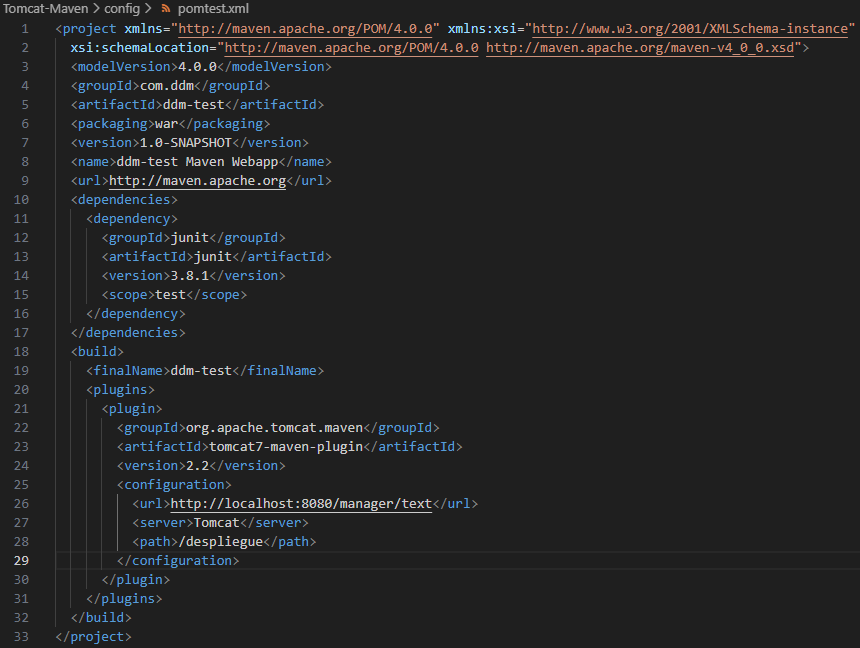

# Práctica de Tomcat y Maven
## Instalaciónde Tomcat
Ejecutamos los siguientes comandos (la imagen es el archivo de provisión, si usas el repositorio, deberían ejecutarse todos los comandos al crear la máquina con Vagrant).
 

### Comprobación de funcionamiento
Usamos el comando **sudo service tomcat9 status** para comprobar que Tomcat está funcionando correctamente.
 

Abrimos **[localhost:8080](http://localhost:8080)** en el navegador y se puede comprobar que funciona
 

## Configuración de la administración
Editamos el archivo **/etc/tomcat9/tomcat-users.xml** para que quede así
 

## Instalar panel administrativo
Instalamos **tomcat9-admin** (en mi cado lo he añadido a la provisión)
 

### Vista gráfica
Y comprobamos que esté
 

 

## Despliegue manual mediante GUI
Usamos un archivo (se ha añadido a la carpeta "additions" para mejor acceso) proporcionado para esta práctica en la interfaz gráfica

Se añade aquí
 

Y debe quedar así
 

## Instalación de Maven
Instalamos **maven**
 

Y añadimos en Tomcat un usuario para la configuración
 

En la configuración de Maven, en **/etc/maven/settings.xml**, lo editamos para añadir las credenciales del paso anterior
 

## Creación de un proyecto
Ejecutamos el comando **mvn archetype:generate -DgroupId=com.ddm -DartifactId=ddm-test -Ddeployment -DarchetypeArtifactId=maven-archetype-webapp -DinteractiveMode=fa**, tiene que acabar así
 

Luego, dentro del directorio que se habrá creado (en este caso, **ddm-test**), editaremos el archivo **pom.xml** de esta forma
 
