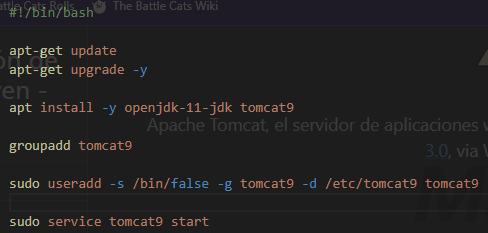
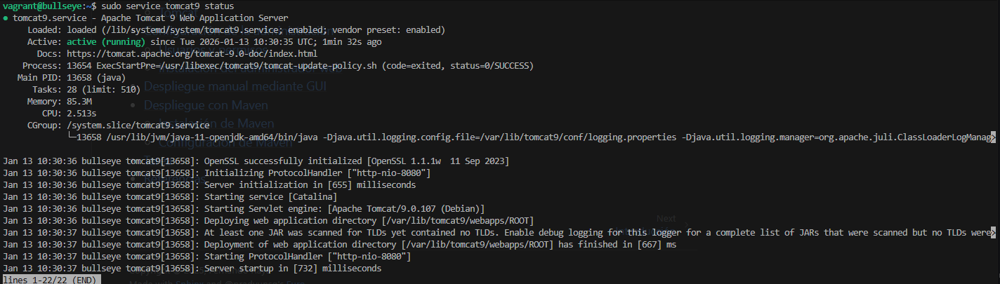
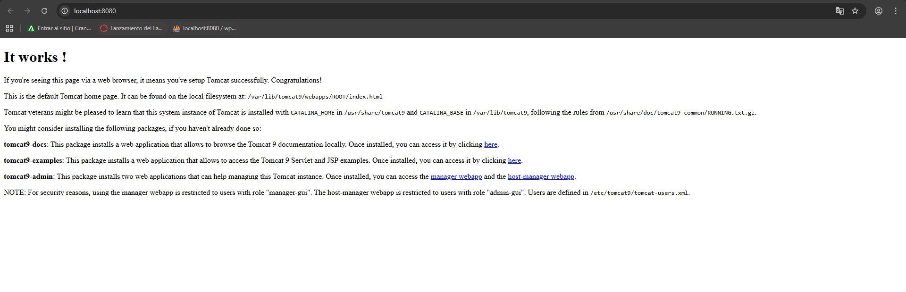
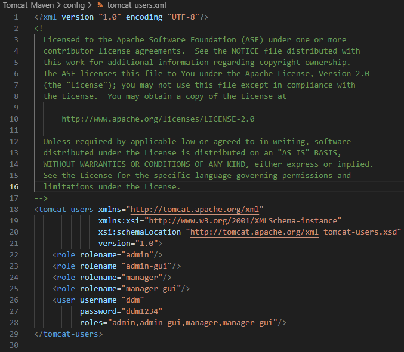
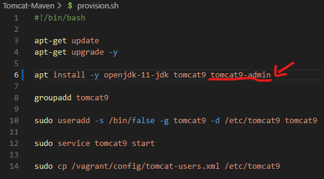
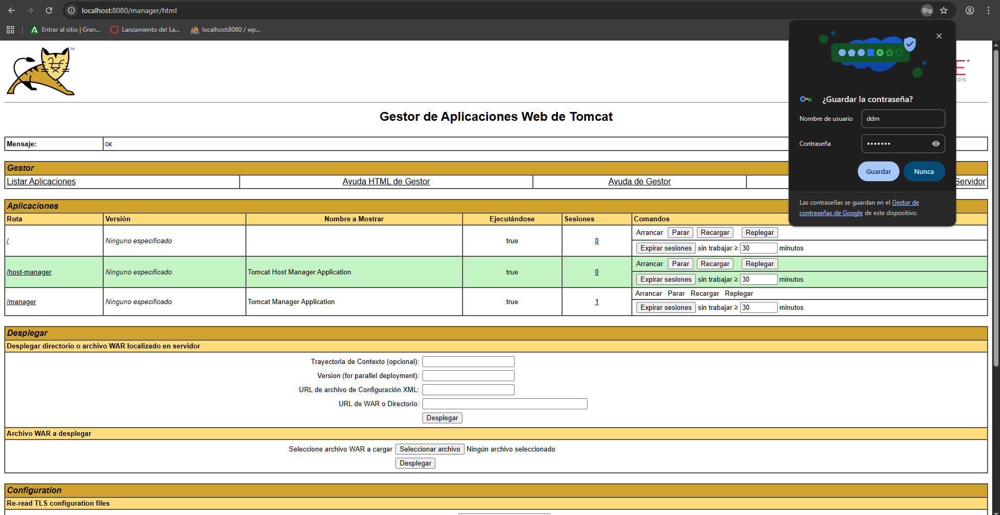
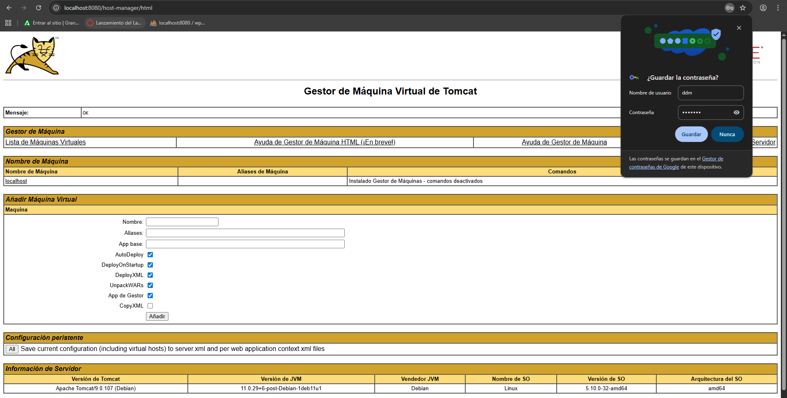

# Práctica de Tomcat y Maven
## Instalaciónde Tomcat
Ejecutamos los siguientes comandos (la imagen es el archivo de provisión, si usas el repositorio, deberían ejecutarse todos los comandos al crear la máquina con Vagrant).
 

### Comprobación de funcionamiento
Usamos el comando **sudo service tomcat9 status** para comprobar que Tomcat está funcionando correctamente.
 

Abrimos **[localhost:8080](http://localhost:8080)** en el navegador y se puede comprobar que funciona
 

## Configuración de la administración
Editamos el archivo **/etc/tomcat9/tomcat-users.xml** para que quede así
 

## Instalar panel administrativo
Instalamos **tomcat9-admin** (en mi cado lo he añadido a la provisión)
 

### Vista gráfica
Y comprobamos que esté
 

 
